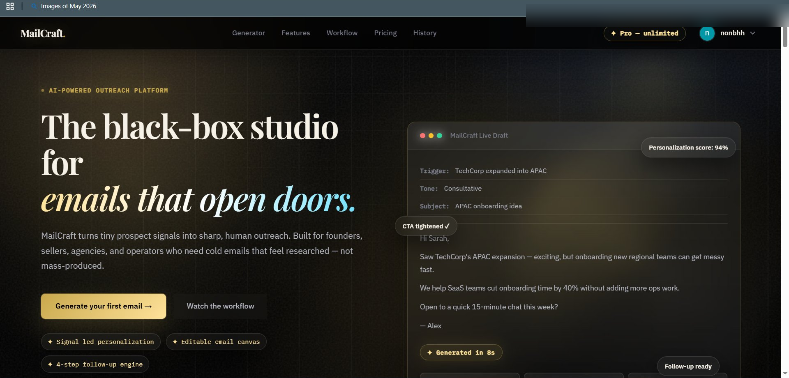
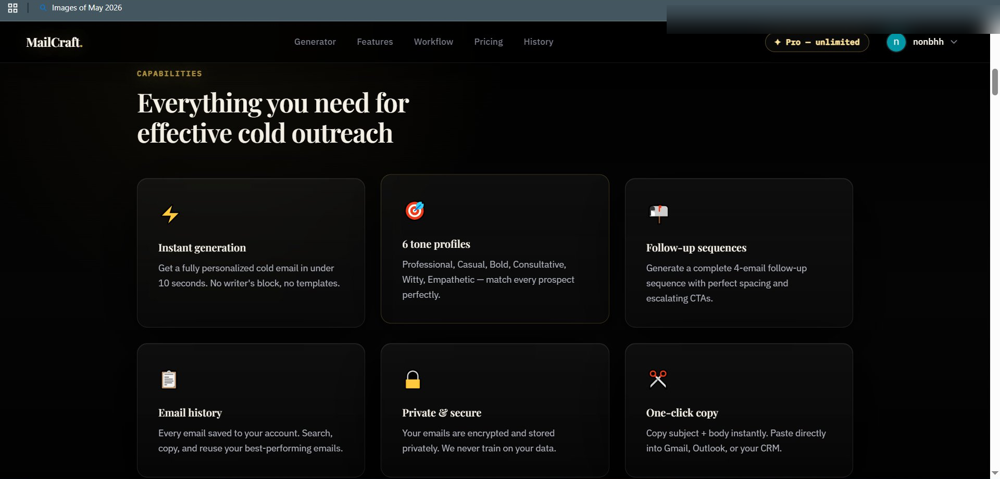
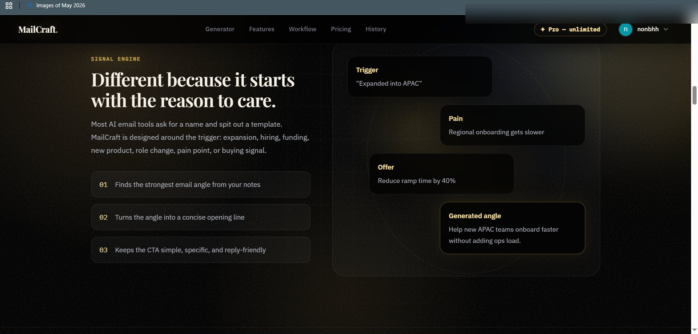

# MailCraft

AI-powered cold outreach platform that generates personalized cold emails and follow-up sequences using Large Language Models.

## Overview

MailCraft helps founders, sales teams, agencies, and professionals create highly personalized cold emails based on prospect signals, business context, and outreach goals.

The platform generates:
- Personalized cold emails
- Multi-step follow-up sequences
- Different outreach tones
- Context-aware messaging

---

## Features

### AI Email Generation
Generate personalized cold emails using AI-powered content generation.

### Follow-Up Sequences
Create structured multi-email follow-up campaigns automatically.

### Multiple Tone Profiles
- Professional
- Casual
- Bold
- Consultative
- Witty
- Empathetic

### User Authentication
Secure Google Sign-In using Firebase Authentication.

### Email History
Store and manage previously generated emails.

### Subscription Support
Premium access with Stripe subscription integration.

### Secure Backend
Serverless backend powered by Cloudflare Workers.

---

## Tech Stack

### Frontend
- HTML5
- CSS3
- JavaScript

### Backend
- Cloudflare Workers
- REST APIs

### Database
- Firebase Firestore

### Authentication
- Firebase Authentication

### AI Integration
- Groq API
- LLM Prompt Engineering

### Payments
- Stripe Checkout
- Stripe Webhooks

---

## Screenshots

### Hero Section

### Features

### Signal Engine

---

## Project Architecture

Frontend
↓
Firebase Authentication
↓
Cloudflare Workers
↓
Groq API
↓
Firestore Database
↓
Stripe Subscription System

---

## Future Improvements

- CRM Integration
- Lead Import via CSV
- Analytics Dashboard
- Team Workspaces
- Email Performance Tracking

---

## Author

**Vignesh Mohan**

GitHub:
https://github.com/vignesh808

LinkedIn:
https://www.linkedin.com/in/vignesh-mohan-b047b925a/

Email:
vighnesh400048@gmail.com